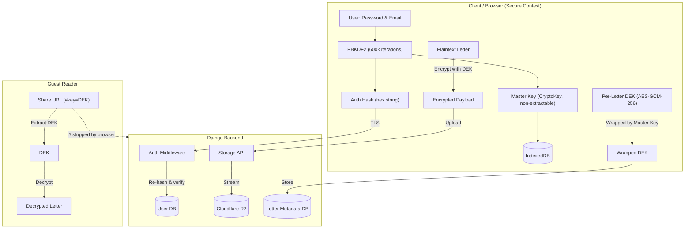

# Pi. Ku.

**A safe haven for your unsaid and unsent letters.**

Pi. Ku. is a zero-knowledge, end-to-end encrypted letter-writing app for the words you've carried too long. Write a letter, seal it in an envelope, send it through a secure link, or lock it away in a time-capsule vault all without the server ever seeing a single word.

> **Live** — [writepiku.app](https://writepiku.app)  
> **Philosophy** — [writepiku.app/know-piku](https://writepiku.app/know-piku)  
> **Video Demo** — [YouTube](https://youtu.be/e9lZdjORkTY)  
> **Source** — [git.ramvignesh.dev/me/pi-ku](https://git.ramvignesh.dev/me/pi-ku/)

---

## What It Does

Authors write letters on a canvas-based editor with image support, seal them into encrypted envelopes, and choose what happens next:

| Action | What happens |
|--------|-------------|
| **Keep** | Stored in your private drawer, encrypted at rest |
| **Send** | Generates a zero-knowledge share link, without needing an account to open the letter |
| **Vault** | Locked with time (time-capsule): even you can't open it until the unlock date. The server emails you on the date when it's ready |
| **Burn** | Release the unsaid words into the wind, ritualistically |

---

## Architecture

### Zero-Knowledge & End-to-End Encryption

The server is intentionally blind. It stores ciphertext it can never decrypt.



**Key points:**

- **Password never leaves the browser in plaintext.** A master key and auth hash are derived locally via PBKDF2 (600k iterations). Only the auth hash is sent over TLS, and the server re-hashes it before storage.
- **Envelope encryption**: each letter gets its own Data Encryption Key (AES-GCM-256), wrapped by the master key. Compromising one letter's key doesn't expose the rest. Future password rotation only requires re-wrapping DEKs, not re-encrypting all content (same pattern as Bitwarden and Standard Notes).
- **Zero-knowledge sharing**: the decryption key lives in the URL fragment (`#key=...`). Browsers strip fragments before sending requests, so the key never touches the server.
- **Master key persistence**: the non-extractable `CryptoKey` is stored in IndexedDB across sessions so users don't re-enter their password on every tab.

### Canvas-Based Letter Editor

The editor is built on **Fabric.js**, it's not just a text editor but a full canvas supporting image placement, multiple font families, color styling, and layout serialization to JSON. The canvas is responsive across mobile and desktop, with dynamic height adjustment, so letters look the same on both viewports.

### Backend Services

- **APScheduler background job** polls for vault letters whose unlock time has passed and triggers email notifications. The scheduler is guarded to run only on the main server process (not during migrations, tests, or duplicate workers).
- **S3-compatible object storage** (Cloudflare R2) for encrypted image blobs: edge-served, decoupled, scalable. Django's default file serving is not used.
- **JWT auth with httpOnly cookies** for refresh tokens. CORS is a strict allowlist. SSL is enforced even in local dev.
- **Structured JSON logging** in production, piped to Grafana (Loki + Alloy) for observability.

---

## Tech Stack

### Frontend
| | |
|---|---|
| **Framework** | React 19, Vite |
| **State** | Zustand |
| **Crypto** | Web Crypto API (PBKDF2, AES-GCM-256) |
| **Canvas** | Fabric.js |
| **Styling** | Tailwind CSS v4, DaisyUI, Phosphor Icons |
| **Animation** | Motion (Framer Motion), Lenis (smooth scroll) |
| **Testing** | Vitest (unit), Playwright (E2E) |

### Backend
| | |
|---|---|
| **Framework** | Django 6, Django REST Framework |
| **Auth** | SimpleJWT (httpOnly cookie refresh) |
| **Scheduler** | APScheduler + django-apscheduler |
| **Storage** | django-storages + boto3 (S3 / Cloudflare R2) |
| **Logging** | structlog + django-structlog |
| **Server** | Gunicorn |
| **DB** | PostgreSQL (w/ SQLite fallback) |

### Infrastructure
| | |
|---|---|
| **Containers** | Docker, Docker Compose |
| **CI/CD** | GitHub Actions / Gitea Runner |
| **Linting** | Biome (frontend), Ruff (backend) |
| **Git Hooks** | Lefthook (pre-commit checks: lint, format, type-check) |
| **Package Managers** | Bun (frontend), uv (backend) |

---

## Testing

The project uses a layered testing strategy:

- **Unit tests**: Vitest (frontend) and Django's test runner (backend) with `freezegun` for time-dependent logic. Frontend coverage threshold at 80%.
- **Integration tests**: MSW (Mock Service Worker) for API mocking in the frontend test suite.
- **E2E tests**: Playwright against the full stack (Chromium + Firefox). Tests cover the complete auth flow, letter CRUD, encryption/decryption, and guest sharing. A dedicated `docker-compose.e2e.yml` runs isolated Postgres and Mailpit containers on separate ports.
- **CI pipeline**: four parallel jobs on every push/PR: env setup, frontend checks (lint + types + unit), backend checks (lint + Django tests), and full E2E.

---

## Running Locally

### Prerequisites

- **Node.js** or **Bun** (frontend)
- **Python 3.14+** with [**uv**](https://docs.astral.sh/uv/) (backend)
- **Docker** / **Podman** (for Postgres & Mailpit containers: optional, see fallbacks below)

### Quick Start (with Docker)

```bash
# Clone
git clone https://git.ramvignesh.dev/me/pi-ku.git && cd pi-ku

# Setup env and install deps
cp .env.example .env
./scripts/setup.sh

# Start everything (containers + migrations + dev servers)
./scripts/start.sh
```

### Without Docker

If you don't have Docker, both the database and email services have local fallbacks:

1. **Database**: set `DB_ENGINE=sqlite` (or comment it out) in `.env` to use a local SQLite file. For PostgreSQL, configure `DB_NAME`, `DB_USER`, `DB_PASSWORD`, `DB_HOST`, `DB_PORT` and set `DB_ENGINE=postgresql`.

2. **Email**: if `EMAIL_HOST` is not configured, the server falls back to printing emails to the console.

3. **Run manually:**
   ```bash
   # Backend
   cd backend
   uv run manage.py migrate
   uv run manage.py serve

   # Frontend (in another terminal)
   cd frontend
   bun run dev
   ```

### Running E2E Tests

```bash
./scripts/run-e2e.sh
```

This spins up an isolated test stack (`docker-compose.e2e.yml`), runs Playwright, and tears everything down. Supports `--ui` mode for interactive debugging.

---

## Self-Hosting & Deployment

The project is fully containerised with production-ready Dockerfiles for both frontend and backend:

- **Frontend**: multi-stage build: Bun installs deps → Vite builds the static bundle → served via Nginx Alpine with SPA routing.
- **Backend**: uv installs deps → runs migrations on startup → serves via Gunicorn.

### Environment Variables

Copy `.env.example` and configure for your environment. Key production variables:

| Variable | Purpose |
|----------|---------|
| `SECRET_KEY` | Django secret key |
| `ALLOWED_HOSTS` | Comma-separated hostnames |
| `CORS_ALLOWED_ORIGINS` | Frontend origin(s) |
| `DB_ENGINE`, `DB_*` | PostgreSQL connection |
| `S3_*` | S3-compatible storage (Cloudflare R2, AWS, MinIO) |
| `EMAIL_HOST`, `EMAIL_*` | SMTP for activation & vault unlock emails |
| `SSL_ENABLED` | Enable HTTPS in dev (`true` generates local certs) |

### Observability

The backend outputs structured JSON logs in production. These are designed to be ingested by **Grafana Loki** (via Alloy) for request tracing and monitoring.

---

## Project Structure

```py
pi-ku/
├── backend/           # Django REST API
│   ├── config/        # Settings, URLs, logging, WSGI
│   ├── letters/       # Letter CRUD, models, serializers, vault scheduler
│   ├── users/         # Custom User model, auth views, email utils
│   ├── scripts/       # Custom management commands (SSL-aware dev server)
│   └── templates/     # Email templates (activation, vault unlock)
├── frontend/          # React SPA (Vite)
│   ├── src/
│   │   ├── api/       # Axios client with JWT interceptor
│   │   ├── components/# Editor, Drawer, Reader, Envelope, UI primitives
│   │   ├── hooks/     # useAuth, useLetters
│   │   ├── store/     # Zustand (auth tokens, crypto keys)
│   │   ├── utils/     # Crypto, keystore (IndexedDB), letter logic
│   │   └── pages/     # Home, Login, Register, Drawer, Editor, Reader, About
│   └── e2e/           # Playwright specs and test utils
├── scripts/           # setup.sh, start.sh, run-e2e.sh
├── certs/             # Local SSL certificates (generated)
├── docker-compose.yml # Dev services (Postgres, Mailpit)
└── docker-compose.e2e.yml # Isolated E2E test services
```

---

> "Sometimes the wrong train takes you to the right station." — Saajan Fernandes, *The Lunchbox*
